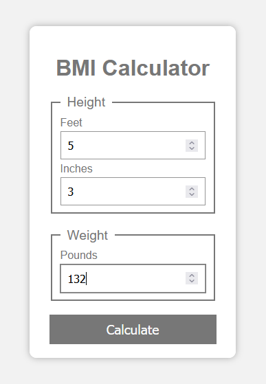
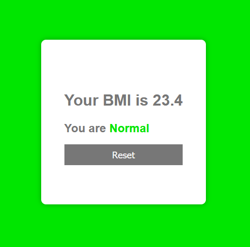

# BMI Calculator
## using JavaScript and HTML/CSS

### Description
This is a simple BMI calculator that uses JavaScript to calculate your BMI based on your height and weight. It also displays a message based on your BMI.

### How to install
1. Clone the repository
2. Open the `index.html` file in your browser

### How to use
1. Enter your height in feet and inches
2. Enter your weight in pounds
3. Click the `Calculate` button

### You can try it out [here](https://aynjel.github.io/bmi-calculator/)

---

# Screenshots

